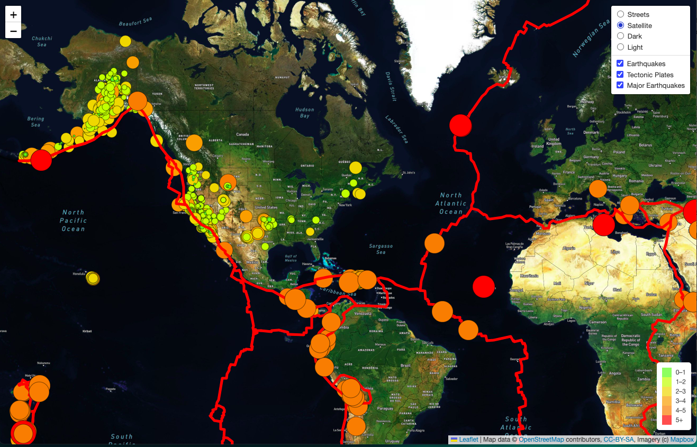
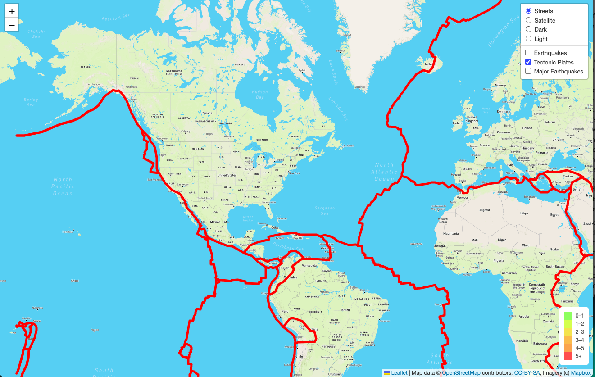
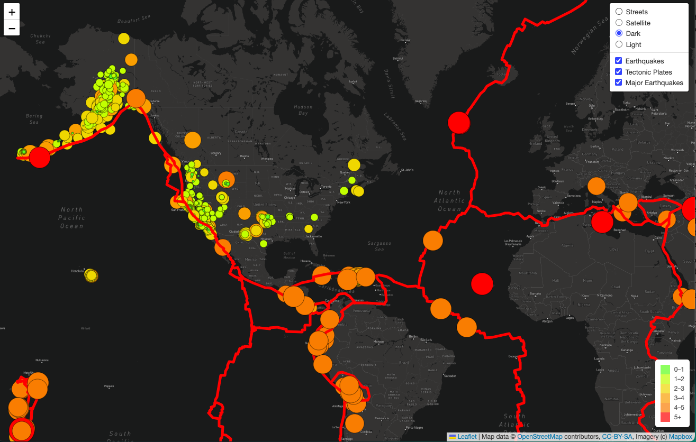
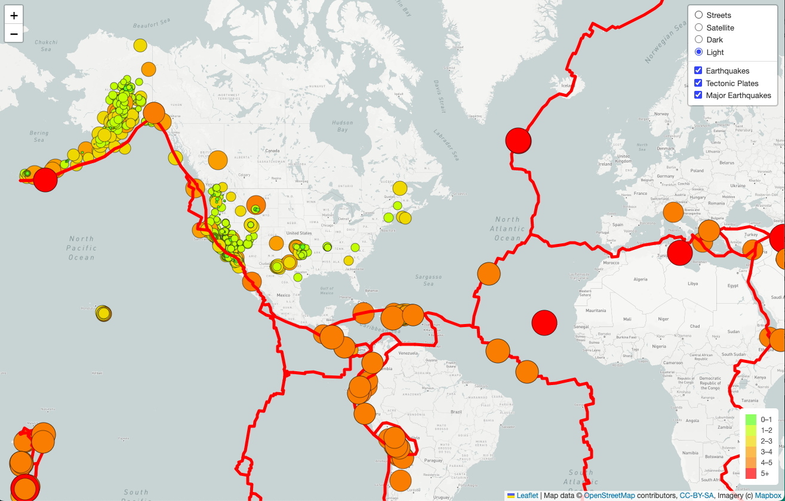

# Mapping_Earthquakes

### Technologies Used

- Leaflet.js
- Javascript
- HTML
- CSS

### Purpose 

For this project the Leaflet.js API was used in combination with GeoJSON data in order to create an interactive, geographical map of earthquakes. Three tile layers were created with this interactive map, allowing the user to view the tectonic plates and their location on the map on one layer, as well as all earthquakes within the past week on another layer, and on the third layer all major earthquakes with a magnitude greater than 4.5 on the Richter scale. 

Each layer can be viewed separately or combined with other layers on the map, for example, if a user wanted to see major earthquakes in comparison to tectonic plates. 

There are four different map styles, streets, satellite, light, and dark for the user to choose from when interacting with the map. 

